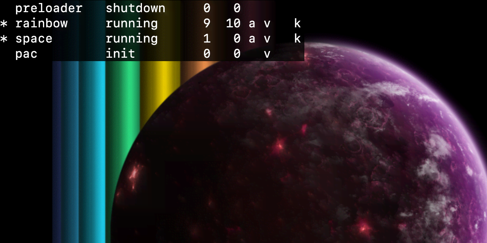

Phaser 3 Scene Watcher Plugin
=============================

For each scene, it shows (left to right):

1. key
2. status
3. display list count
4. update list count
5. active (a)
6. visible (v)
7. transitioning (t)
8. [input active](https://newdocs.phaser.io/docs/3.60.0/focus/Phaser.Input.InputPlugin-isActive) (i)
9. [keyboard input active](https://newdocs.phaser.io/docs/3.60.0/focus/Phaser.Input.Keyboard.KeyboardPlugin-isActive) (k)

See the [demo](https://codepen.io/samme/pen/VBbJZM) or [Cavern Quest](https://samme.itch.io/cavern-quest).

Browser / UMD
-------------

Use [phaser-plugin-scene-watcher.umd.js](dist/phaser-plugin-scene-watcher.umd.js) and the global `PhaserSceneWatcherPlugin`.

```javascript
/* global PhaserSceneWatcherPlugin */
new Phaser.Game({
  plugins: {
    global: [
      { key: 'SceneWatcher', plugin: PhaserSceneWatcherPlugin, start: true }
    ]
  },
});
```

Module
------

Install `phaser-plugin-scene-watcher` from npm or yarn and import:

```javascript
import SceneWatcherPlugin from 'phaser-plugin-scene-watcher';
```

Or import directly from [phaser-plugin-scene-watcher.esm.js](dist/phaser-plugin-scene-watcher.esm.js):

```javascript
import SceneWatcherPlugin from 'path/to/phaser-plugin-scene-watcher.esm.js';
```

Then pass the imported value in the game's plugin config:

```javascript
new Phaser.Game({
  plugins: {
    global: [
      { key: 'SceneWatcher', plugin: SceneWatcherPlugin, start: true }
    ]
  },
});
```

Quick load
----------

```javascript
function preload () {
  this.load.plugin('PhaserSceneWatcherPlugin', 'https://cdn.jsdelivr.net/npm/phaser-plugin-scene-watcher@6.0.0/dist/phaser-plugin-scene-watcher.umd.js', true);
}
```

Log scene events to console
---------------------------

`watchAll()` starts logging scene events for **all** existing scenes. Call it **once** after all scenes are added.

From the game configuration:

```javascript
new Phaser.Game({
  callbacks: {
    postBoot: function (game) {
      // Use the `key` you added the plugin with.
      game.plugins.get('SceneWatcher').watchAll();
    }
  }
});
```

From a scene:

```javascript
function init () {
  // Use the `key` you added the plugin with.
  this.plugins.get('SceneWatcher').watchAll();
}
```
